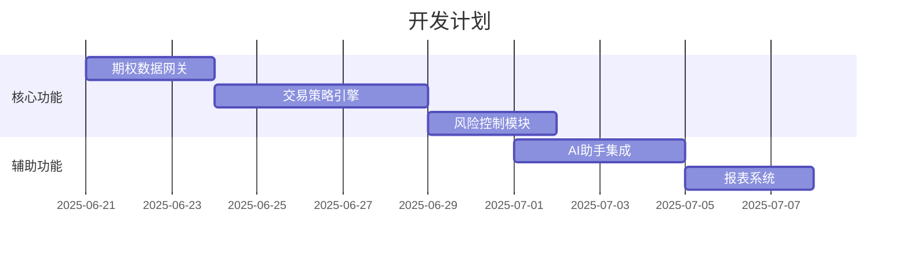

# 活跃上下文

## 当前工作焦点
- 期权数据获取网关实现
- 交易策略引擎开发
- 账户管理模块

## 最近修改
`2025-06-20`：初始化内存银行文档结构
- 创建核心文档框架
- 定义系统架构和设计模式
- 记录技术栈和开发环境

## 关键决策
1. **网关实现选择**：
   - 优先实现Futu API网关
   - LongPort网关作为备选方案

2. **策略引擎设计**：
   - 使用模板引擎（FreeMarker）定义策略逻辑
   - 支持策略热加载

## 待解决问题
- 期权链数据实时更新机制
- 多账户并发交易锁设计
- 希腊值计算性能优化

## 下一步计划

## 重要提醒
- 所有数据库变更需同步更新init.sql和upgrade脚本
- API模块变更需同步更新Provider和Start模块
