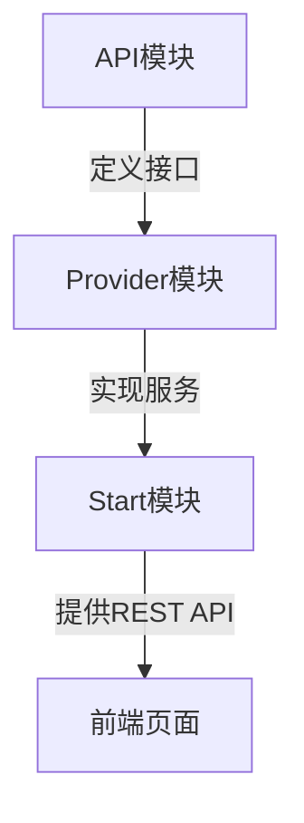

# 项目概要

## 项目名称
期权交易系统

## 核心目标
构建自动化期权交易系统，支持策略回测、实时交易监控和风险管理

## 关键特性
- 多券商接口集成（Futu/LongPort）
- 实时期权链数据分析
- 自定义交易策略引擎
- 账户风险控制模块
- AI交易助手

## 技术栈
- 后端：Java 17, Spring Boot
- 前端：LayUI, Chart.js
- 数据库：MySQL
- 构建工具：Maven

## 模块架构

## 主要用户
- 期权交易员
- 量化研究员
- 风险管理师

## 开发阶段
`当前阶段：核心架构开发`
