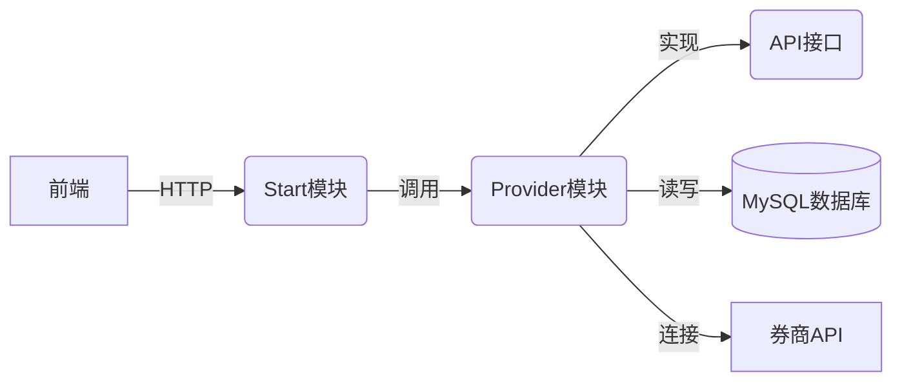
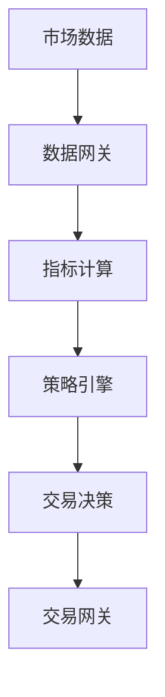

# 系统模式

## 架构概览


## 核心设计模式
1. **分层架构**：
   - API层：纯接口定义
   - Provider层：业务逻辑实现
   - Start层：REST API暴露和Web控制

2. **网关模式**：
   - CandlestickGateway：K线数据获取
   - OptionsChainGateway：期权链数据获取
   - OptionsTradeGateway：期权交易执行

3. **事件驱动**：
   - 事件发布/订阅机制处理异步操作
   - EventPublisher发布事件
   - EventProcesser处理事件

## 关键实现路径
### 期权交易流程
```mermaid
sequenceDiagram
    前端->>+Start模块： 提交交易请求
    Start模块->>+Provider模块： 调用交易服务
    Provider模块->>+券商网关： 执行交易
    券商网关-->>-Provider模块： 返回结果
    Provider模块->>数据库： 持久化订单
    Provider模块-->>-Start模块： 返回交易结果
    Start模块-->>-前端： 响应交易状态
```

### 数据流


## 组件关系
| 组件 | 职责 | 依赖 |
|------|------|------|
| OptionsManager | 期权数据管理 | OptionsChainGateway, IndicatorManager |
| TradeManager | 交易执行 | OptionsTradeGateway, OwnerManager |
| PushDataManager | 实时数据推送 | WebSocket连接, 数据网关 |
| IndicatorManager | 技术指标计算 | CandlestickGateway, VixQueryGateway |
