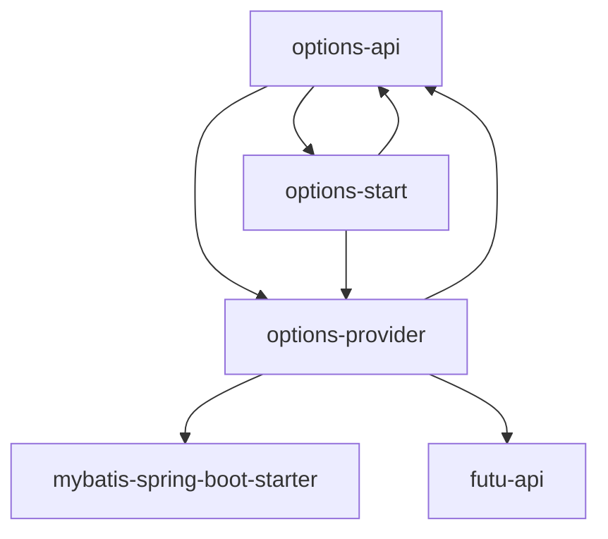

# 技术上下文

## 核心技术栈
| 类别 | 技术选型 | 版本 |
|------|-----------|------|
| 后端 | Java | 17 |
| 框架 | Spring Boot | 3.1.0 |
| 数据库 | MySQL | 8.0 |
| ORM | MyBatis | 3.0.1 |
| 前端 | LayUI | 2.8.3 |
| 图表 | Chart.js | 3.9.1 |
| 构建 | Maven | 3.8.6 |

## 开发环境
1. **JDK配置**：
   - 必须使用 Java 17
   - 推荐使用 Amazon Corretto 17

2. **数据库设置**：
   - 初始化脚本：start/src/main/resources/db/init.sql
   - 升级脚本目录：start/src/main/resources/db/upgrade

3. **构建命令**：
   ```bash
   # 完整构建
   mvn clean package
   
   # 跳过测试
   mvn clean package -DskipTests
   
   # 运行应用
   ./run.sh
   ```

## 关键依赖


## 配置管理
- **配置文件**：start/src/main/resources/application.yml
- **安全配置**：
  - 私钥路径：example.futu_rsa_private.key
  - 通过ConfigUtils类读取配置

## 工具使用规范
1. **代码生成**：
   - MyBatis Generator 用于DAO和Mapper生成
   
2. **API文档**：
   - 使用Spring Doc OpenAPI生成接口文档
   - 访问路径：/swagger-ui/index.html

3. **日志管理**：
   - SLF4J + Logback
   - 日志文件：logs/application.log
